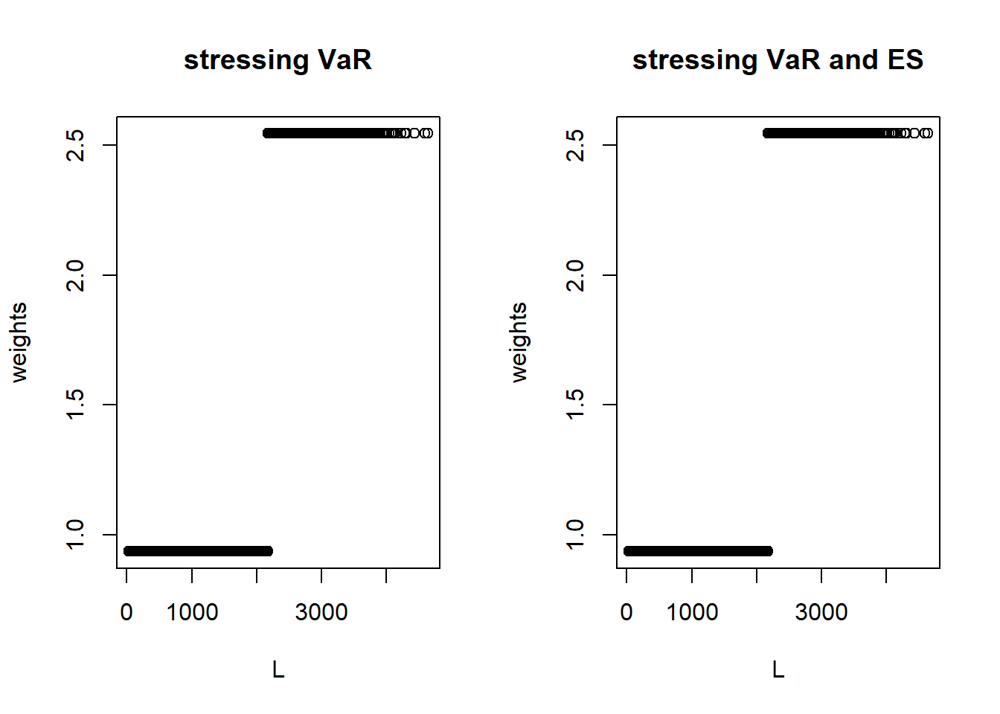
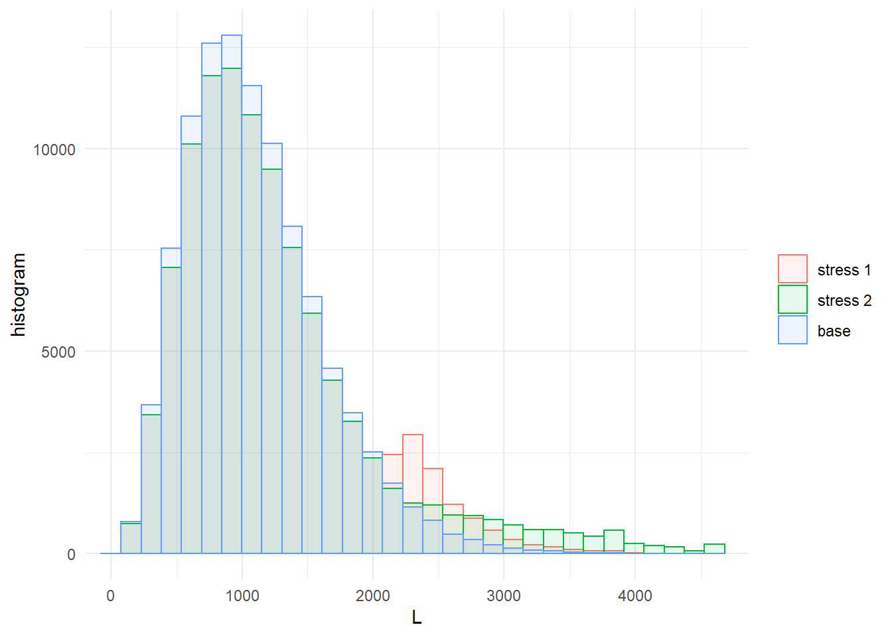
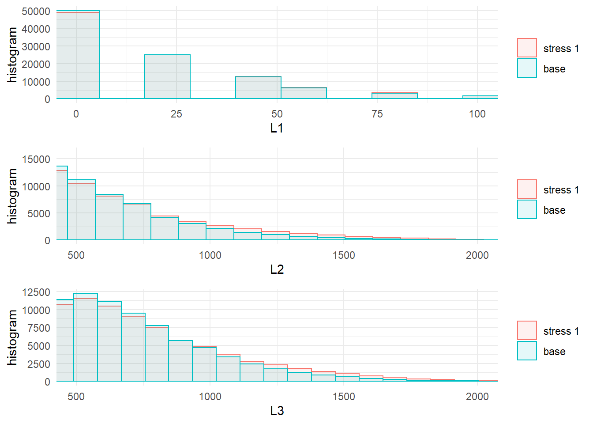

# Simulation study {#Sec:CreditModel}

## A credit risk portfolio 


The credit model in this section is a conditionally binomial loan portfolio model including systematic and specific portfolio risk. We refer to the Appendix \@ref(AppendixCM) for details and the generation of the simulated data. Of interest is the total aggregate portfolio loss $L = L_1 + L_2 + L_3$, where $L_1, L_2, L_3$ are homogeneous subportfolios on  comparable scale (say, thousands of \$). The data set contains 100,000 simulations of the portfolio $L$, the sub-portfolios $L_1, L_2, L_3$ as well as the default probability of each subportfolio $H_1, H_2, H_3$. These (conditional) default probabilities represent the sytematic risk *within* each subportfolio, and their dependence structure allows to introduce a systematic risk effect *between* the subportfolios. A snippet of the data set looks as follows:


```
##         L L1    L2  L3       H1      H2     H3
## [1,]  692  0 346.9 345 1.24e-04 0.00780 0.0294
## [2,] 1006 60 515.6 430 1.16e-03 0.01085 0.0316
## [3,] 1661  0 806.2 855 5.24e-04 0.01490 0.0662
## [4,] 1708  0 937.5 770 2.58e-04 0.02063 0.0646
## [5,]  807  0  46.9 760 8.06e-05 0.00128 0.0632
## [6,] 1159 20 393.8 745 2.73e-04 0.00934 0.0721
```


## Stressing the aggregate portfolio loss 

In this section, following a reverse sensitivity approach, we study the effect of stresses on (the tail of) the aggregate portfolio on the three sub-portfolios in order to investigate their importance. 

First, we impose a $20\%$ increase on the $VaR_{0.9}$ of the loss of the aggregate portfolio.


```r
stress.credit <- stress(type = "VaR", x = credit_data, k = "L", alpha = 0.9, q_ratio = 1.2)
```

```
## Stressed VaR specified was 2174.25 , stressed VaR achieved is 2173.75
```

Note that, since we work with a simulated set of losses, the exact required quantile may not be achievable. By default, `stress_VaR` will target the smallest value in the data set larger than the required VaR. ++++IS IT CORRECT? IN THE CURRENT EXAMPLE IT IS LOWER! DID IT GET IT WRONG)++++

The imposed change in VaR determines an increase in ES.

```r
ES_stressed(object = stress.credit, alpha = 0.9, xCol = "L")
```

```
##            L
## 90% 2534.809
```

++++DOES ES_stressed WORK WITH MULTIPLE STRESSES? WOULD IT BE POSSIBLE TO EXTEND IT (AND quantile_stressed AS WELL) TO CALCULATE THESE QUANTITIES ON BASELINE OBJECTS (VECTORS, MATRICES OR DATA FRAMES)?+++

We then consider, additionally to the $20\%$ increase in $\text{VaR}_{0.9}$, a further increase in $\text{ES}_{0.9}$ of the aggregate portfolio $L$. Note that both VaR and ES need be stressed at the same level `alpha = 0.9`. Instead of providing the percentage increases in the VaR and ES through the arguments `q_ratio` and `s_ratio`, the actual stressed values of VaR and ES can be set using the arguments `q` and `s`, respectively. 


```r
stress.credit <- stress(type = "VaR ES", x = stress.credit, k = "L", alpha = 0.9, q_ratio = 1.2, s = 3500)
```

```
## Stressed VaR specified was 2174.25 , stressed VaR achieved is 2173.75
```

When applying the `stress` function, or one of its alternative versions, to a SWIM object, the result will be a new SWIM object where the new stress has been ''appended'' to the previous one. This is convenient when large data sets are involved, as the `stress` function returns an object  containing the original simulated data and the scenario weights. 

++++MAYBE CHANGE THE SECOND STRESS ACCORDING TO ANDREAS' SUGGESTION? IE LEAVE VAR UNCHANGED (CURRENTLY NOT POSSIBLE) AND STRESS ES ONLY?++++
++++I TRIED STRESSING THE ES A LOT, NOT SURE OF THE RESULT. GRAPHICALLY NOT MUCH CAN BE SEEN++++

## Analysing the stressed model

The `summary` function provides a statistical summary of the stressed models. Choosing  `base = TRUE`, compares the stressed models with the the simulated data - the baseline model.


```r
summary(stress.credit, base = TRUE)
```

```
## $base
##                    L    L1     L2      L3       H1      H2     H3
## mean        1102.914 19.96 454.04 628.912 0.000401 0.00968 0.0503
## sd           526.538 28.19 310.99 319.715 0.000400 0.00649 0.0252
## skewness       0.942  2.10   1.31   0.945 1.969539 1.30834 0.9501
## ex kurtosis    1.326  6.21   2.52   1.256 5.615908 2.49792 1.2708
## 1st Qu.      718.750  0.00 225.00 395.000 0.000115 0.00490 0.0318
## Median      1020.625  0.00 384.38 580.000 0.000279 0.00829 0.0464
## 3rd Qu.     1398.750 20.00 609.38 810.000 0.000555 0.01296 0.0643
## 
## $`stress 1`
##                   L    L1     L2     L3       H1      H2     H3
## mean        1193.39 20.83 501.10 671.46 0.000417 0.01066 0.0536
## sd           623.48 29.09 363.57 361.21 0.000415 0.00756 0.0285
## skewness       1.01  2.09   1.36   1.02 1.973337 1.35075 1.0283
## ex kurtosis    0.94  6.14   2.23   1.22 5.630153 2.23353 1.2382
## 1st Qu.      739.38  0.00 234.38 405.00 0.000120 0.00512 0.0328
## Median      1065.62 20.00 412.50 605.00 0.000290 0.00878 0.0483
## 3rd Qu.     1505.62 40.00 675.00 865.00 0.000578 0.01422 0.0688
## 
## $`stress 2`
##                   L    L1     L2     L3       H1      H2     H3
## mean        1240.94 21.30 528.73 690.91 0.000427 0.01122 0.0552
## sd           750.61 29.90 435.15 405.26 0.000433 0.00901 0.0319
## skewness       1.64  2.14   1.92   1.38 2.060844 1.91260 1.3718
## ex kurtosis    3.20  6.61   4.68   2.44 6.144161 4.80920 2.3599
## 1st Qu.      739.38  0.00 234.38 405.00 0.000121 0.00512 0.0328
## Median      1065.62 20.00 412.50 605.00 0.000294 0.00879 0.0484
## 3rd Qu.     1505.62 40.00 675.00 870.00 0.000587 0.01432 0.0694
```

The information on individual stresses can be recovered through the `get_specs` function and the actual scenario weights using `get_weight`.


```r
get_specs(stress.credit)
```

```
##            type k alpha    q    s
## stress 1    VaR L   0.9 2174 <NA>
## stress 2 VaR ES L   0.9    1 3500
```

```r
w <- get_weights(stress.credit)
par(mfrow = c(1, 2))
plot(x = credit_data[, "L"], y = w[, 1], xlab = "L", ylab = "weights", main ="stressing VaR")
plot(x = credit_data[, "L"], y = w[, 1], xlab = "L", ylab = "weights", main = "stressing VaR and ES")
```



## Visual comparison
The change in the distributions of the portfolio and subportfolios from the baseline to the stressed models can be visualised through the functions `plot_hist` and `plot_cdf`. The following figure displays the histogram of the aggregate portfolio loss under the baseline and the two stressed models.


```r
plot_hist(object = stress.credit, xCol = "L", base = TRUE)
```



The arguments `xCol` and `wcol` specify the columns of the data to be plotted and the scenario weights to be used, respectively. The impact on the subportfoios of stressing the aggregate loss can thus be investigated. ROLE OF wcol? I TRIED CHANGING IT BUT NO SUCCESS The graphical functions `plot_hist` and `plot_cdf` functions return objects compatible with the package **ggplot2**. Thus, we can compare the histograms of the portfolio losses via the function `grid.arrange` (of the package **gridExtra**).


```r
library(gridExtra)
pL1 <- plot_hist(object = stress.credit, xCol = 2, wCol = 1, base = TRUE, x_limits = c(0, 100))
pL2 <- plot_hist(object = stress.credit, xCol = 3, wCol = 1, base = TRUE,  x_limits = c(500, 2000))
pL3 <- plot_hist(object = stress.credit, xCol = 4, wCol = 1, base = TRUE,  x_limits = c(500, 2000))
class(pL1)
```

```
## [1] "gg"     "ggplot"
```

```r
grid.arrange(pL1, pL2, pL3, ncol = 1, nrow = 3)
```



From the plots we observe, that the subportfolios $L_2$ and $L_3$ are significantly affected by the stress, while the distribution of $L_1$ is almost unchanged. 

++++I TRIED SIDE BY SIDE, IT IS VERY CLUMSY AND NOT MUCH CAN BE SEEN. ALSO, NOT MUCH IS GAINED BY CUTTING THE X AXIS++++


## Sensitivity measures

The impact of the stressed models on the model components can be quantified through sensitivity measures. The function `sensitivity` includes *Kolmogorov*, the *Wasserstein* distance and the sensitivity measure *Gamma*, which can be specified through the optional argument `type`. We refer to Section \@ref(Sec:analysis) for the definitions of these measures. The Kolmogorov and the Wasserstein distance are useful to compare different stressed models, whereas the sensitivity measure Gamma ranks model components for one stressed model.


```r
sensitivity(object = stress.credit, xCol = c(2 : 7), wCol = 1, type = "Gamma")
```

```
##     stress  type   L1    L2    L3    H1    H2    H3
## 1 stress 1 Gamma 0.15 0.819 0.772 0.196 0.811 0.767
```

Using the `sensitivity` function we can analyse whether the first (column 2) and third (column 4) tranches are able to exceed the riskiness of the second. This can be accomplished specifying, through the option `f`, a list of functions applicable to the columns `k` of the dataset. Through the argument `xCol = NULL` only the transformed data is considered. The sensitivity measure of a function of the columns is particularly useful when high dimensional models are considered and a resuming statistics is needed in order to compare blocks of model components against each others.


```r
sensitivity(object = stress.credit, type = "Gamma", f = list(sum), k = list(c(2, 4)), xCol = NULL, wCol = 1)
```

```
##     stress  type    f1
## 1 stress 1 Gamma 0.783
```

```r
sensitivity(object = stress.credit, type = "Gamma", f = list(sum), k = list(c(2, 4)), xCol = NULL, wCol = 2)
```

```
##     stress  type    f1
## 1 stress 2 Gamma 0.645
```

++++CAN WE ALLOW FOR "f" and "k" TO BE A FUNCTION AND A VECTOR, RESPECTIVELY, AS IN stress_moments?++++

The `importance_rank` function, having the same structure as the `sensitivity` function, return the ranks of the sensitivity measures. This function is particularly useful when there several risk factors involved.


```r
importance_rank(object = stress.credit, xCol = c(2 : 7), wCol = 1, type = "Gamma")  
```

```
##     stress  type L1 L2 L3 H1 H2 H3
## 1 stress 1 Gamma  6  1  3  5  2  4
```

It transpires that subportfolios $2$ and $3$ are, in this order, most responsible for the stress in the global loss. Also, most of the sensitivity seems to be imputable to the systematic risk components $H_2$ and $H_3$. To confirm this, another stress resulting in the same $\text{VaR}_{90\%}(L)$, but controlling for the distribution of $H_2$, can be imposed using the function `stress_moment`. More precisely, we fix $E[H_2]$ and the $75\%$ quantile of $H_2$ as in the base model.


```r
VaR.L <- quantile(x = credit_data[, "L"], prob = 0.9, type = 1)
q.H2 <- quantile(x = credit_data[, "H2"], prob = 0.75, type = 1)
str.var.credit2 <- stress_moment(x = credit_data,
                                 f = list(function(x)1 * (x <= VaR.L * 1.2),
                                          function(x)x,
                                          function(x)1 * (x <= q.H2)),
                                 m = c(0.9, mean(credit_data[, "H2"]), 0.75),
                                 k = c(1, 6, 6), show = TRUE)
```

```
## $x
## [1]   1.75360577  -1.47420629 -33.85297671  -0.06625847
## 
## $fvec
## [1]  1.581201e-09 -9.911545e-10  3.890762e-11  1.316981e-10
## 
## $termcd
## [1] 1
## 
## $message
## [1] "Function criterion near zero"
## 
## $scalex
## [1] 1 1 1 1
## 
## $nfcnt
## [1] 15
## 
## $njcnt
## [1] 1
## 
## $iter
## [1] 12
```

```r
 stress.credit <- stress_moment(x = stress.credit, f =  list(function(x)1 * (x <= VaR.L * 1.2), function(x)x, function(x)1 * (x <= q.H2)), m = c(0.9, mean(credit_data[, "H2"]), 0.75), k = c(1, 6, 6))
summary(str.var.credit2)
```

```
## $`stress 1`
##                        L        L1         L2         L3           H1
## mean        1140.5354634 20.055743 456.009433 664.470287 0.0004004611
## sd           616.9303342 28.482651 340.852509 371.139871 0.0004046357
## skewness       1.0587236  2.125213   1.404357   1.090368 2.0131956190
## ex kurtosis    0.8946579  6.395638   2.302149   1.312725 5.8996342470
## 1st Qu.      695.0000000  0.000000 206.250000 395.000000 0.0001129192
## Median      1001.8750000  0.000000 365.625000 590.000000 0.0002762449
## 3rd Qu.     1430.6250000 20.000000 609.375000 855.000000 0.0005542238
##                      H2         H3
## mean        0.009684892 0.05303803
## sd          0.007062589 0.02921879
## skewness    1.391352645 1.09490268
## ex kurtosis 2.265056699 1.33711588
## 1st Qu.     0.004531472 0.03175890
## Median      0.007857225 0.04718364
## 3rd Qu.     0.012955333 0.06789288
```

```r
 summary(stress.credit)
```

```
## $`stress 1`
##                        L        L1         L2         L3           H1
## mean        1193.3857930 20.831143 501.097992 671.456658 0.0004165732
## sd           623.4846001 29.089037 363.570216 361.210270 0.0004153808
## skewness       1.0128783  2.085416   1.358798   1.023719 1.9733372317
## ex kurtosis    0.9396505  6.137944   2.234912   1.218835 5.6301528473
## 1st Qu.      739.3750000  0.000000 234.375000 405.000000 0.0001198463
## Median      1065.6250000 20.000000 412.500000 605.000000 0.0002901372
## 3rd Qu.     1505.6250000 40.000000 675.000000 865.000000 0.0005775576
##                      H2         H3
## mean        0.010655445 0.05362503
## sd          0.007561023 0.02846252
## skewness    1.350746591 1.02834250
## ex kurtosis 2.233530201 1.23819802
## 1st Qu.     0.005117044 0.03279018
## Median      0.008778713 0.04834310
## 3rd Qu.     0.014221464 0.06884588
## 
## $`stress 2`
##                       L        L1         L2         L3           H1
## mean        1289.904893 21.700135 558.272481 709.932277 0.0004368972
## sd           875.895228 30.566506 507.780361 447.304978 0.0004484146
## skewness       1.904647  2.170868   2.104241   1.569286 2.0904252485
## ex kurtosis    3.674787  6.743501   4.793874   2.796753 6.2034288866
## 1st Qu.      739.375000  0.000000 234.375000 405.000000 0.0001228676
## Median      1065.625000 20.000000 412.500000 605.000000 0.0002970796
## 3rd Qu.     1505.625000 40.000000 675.000000 875.000000 0.0005939864
##                      H2         H3
## mean        0.011804242 0.05663839
## sd          0.010448927 0.03510638
## skewness    2.101275755 1.53844360
## ex kurtosis 4.970004195 2.61418427
## 1st Qu.     0.005117705 0.03279281
## Median      0.008789480 0.04838916
## 3rd Qu.     0.014392481 0.06972752
## 
## $`stress 3`
##                        L        L1         L2         L3           H1
## mean        1140.5354634 20.055743 456.009433 664.470287 0.0004004611
## sd           616.9303342 28.482651 340.852509 371.139871 0.0004046357
## skewness       1.0587236  2.125213   1.404357   1.090368 2.0131956190
## ex kurtosis    0.8946579  6.395638   2.302149   1.312725 5.8996342470
## 1st Qu.      695.0000000  0.000000 206.250000 395.000000 0.0001129192
## Median      1001.8750000  0.000000 365.625000 590.000000 0.0002762449
## 3rd Qu.     1430.6250000 20.000000 609.375000 855.000000 0.0005542238
##                      H2         H3
## mean        0.009684892 0.05303803
## sd          0.007062589 0.02921879
## skewness    1.391352645 1.09490268
## ex kurtosis 2.265056699 1.33711588
## 1st Qu.     0.004531472 0.03175890
## Median      0.007857225 0.04718364
## 3rd Qu.     0.012955333 0.06789288
```

```r
sensitivity(object = str.var.credit2, xCol = c(2 : 7), type = "Gamma")
```

```
##     stress  type         L1         L2        L3            H1           H2
## 1 stress 1 Gamma 0.01021874 0.02031374 0.3663414 -0.0005209693 1.166618e-08
##          H3
## 1 0.3591785
```

```r
 sensitivity(object = stress.credit, xCol = c(2 : 7), type = "Gamma")
```

```
##     stress  type         L1         L2        L3            H1           H2
## 1 stress 1 Gamma 0.15011211 0.81946608 0.7723621  0.1963720925 8.113067e-01
## 2 stress 2 Gamma 0.11313252 0.73364958 0.6385973  0.1714682450 7.079403e-01
## 3 stress 3 Gamma 0.01021874 0.02031374 0.3663414 -0.0005209693 1.166618e-08
##          H3
## 1 0.7673356
## 2 0.6363609
## 3 0.3591785
```

+++THIS SHOULD BE APPENDED TO "stress.credit" WHEN "stress_moment" IS FIXED
It is then clear that systematic risk prevails on binomial (event) risk. 

The `stress_moment` function is flexible and allows different type of stresses to be imposed on a model. The following example forces a $50\%$ increase in correlation between the losses in the second and third portfolios, while keeping the means und standard deviations unchanged.


```r
m.L2 <- mean(credit_data[, "L2"])
m.L3 <- mean(credit_data[, "L3"])
m2.L2 <- mean(credit_data[, "L2"] ^ 2)
m2.L3 <- mean(credit_data[, "L3"] ^ 2)
cov.L2.L3 <- cov(credit_data[, "L2"], credit_data[, "L3"])
# str.var.credit2 <- stress_moment(x = credit_data,
#                                 f = list(function(x)x,
#                                          function(x)x,
#                                          function(x)x ^ 2,
#                                          function(x)x ^ 2,
#                                          function(x)x[1] * x[2] - m.L2 * m.L3),
#                                 k = list(3, 4, 3, 4, c(3, 4)),
#                                 m = c(m.L2, m.L3, m2.L2, m2.L3, cov.L2.L3 * 1.5)
```
+++CURRENTLY DOES NOT RUN - NEEDS TO BE FIXED OR REPLACED


+++FINAL COMMENTS?
