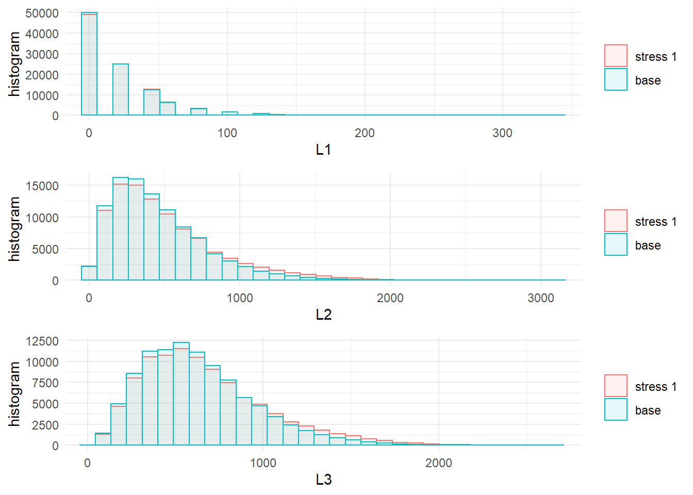

# Simulation study {#Sec:CreditModel}

## The credit risk portfolio 


The credit model in this section is a conditionally binomial credit model and we refer to the Appendix \@ref(AppendixCM) for details and the generation of the simulated data. Of interest ist the total aggregate portfolio loss $L = L_1 + L_2 + L_3$, where $L_1, L_2, L_3$ are homogeneous subportfolios on comparable scale. The data set contains 100,000 simulations of the portfolio $L$, the sub-portfolios $L_1, L_2, L_3$ as well as the (conditional) default probability of each subportfolio $H_1, H_2, H_3$. A snipped of data set looks as follows:


```
##         L L1    L2  L3       H1      H2     H3
## [1,]  692  0 346.9 345 1.24e-04 0.00780 0.0294
## [2,] 1006 60 515.6 430 1.16e-03 0.01085 0.0316
## [3,] 1661  0 806.2 855 5.24e-04 0.01490 0.0662
## [4,] 1708  0 937.5 770 2.58e-04 0.02063 0.0646
## [5,]  807  0  46.9 760 8.06e-05 0.00128 0.0632
## [6,] 1159 20 393.8 745 2.73e-04 0.00934 0.0721
```


## Stressing the aggregate portfolio loss 

In this section, we study the effect of stresses on (the tail of) the aggregate portfolio on the three sub-portfolios. First, we stress the $VaR_{0.9}$ of the total loss of the aggregate portfolio by $20\%$. For this we use the `stress` function with the argument `type = "VaR"`. The input parameter `x` is the simulated data, `k` corresponds to the name of the row of `x` on which the stress is applied to, `alpha` determines the level of the stresses VaR and `q_ratio` the percentage increase.


```r
stress.credit <- stress(type = "VaR", x = credit_data, k = "L", 
                        alpha = 0.9, q_ratio = 1.2)
```

Second, we consider, additionally to the $20\%$ increase in $\text{VaR}_{0.9}$, a $30\%$ increase in $\text{ES}_{0.9}$ of the aggregate portfolio $L$. Generating a stressed model, resulting from a simultaneous stress on the VaR and the ES can be acchieve using `type = "VaR ES"`. Note that both VaR and ES need be stressed at the same level `alpha = 0.9`. The additonal input parameter `s_ratio` determines the percentage increase in the ES. Instead of providing the percentage inceases in the VaR and ES, the `stress` function allows for the actual stressed values of the VaR and ES using the parameters `s` and `q` instead of `s_ratio` and `q_ratio`, respectively. 


```r
stress.credit <- stress(type = "VaR ES", x = stress.credit, k = "L", 
                        alpha = 0.9, q_ratio = 1.2, s_ratio = 1.3)
```

Note, that as input `x` we used the above calucalted stressed model, resulting from a stress on the $VaR_{0.9}$. Using a stressed model as an input for the `stress` function is convenient for large data sets, as the `stress` function returns an object (`stress.credit`) that countains the original simualted data and the scenario weights. 

++++MAYBE CHANGE THE SECOND STRESS ACCORDING TO ANDREAS' SUGGESTION? IE LEAVE VAR UNCHANGED (CURRENTLY NOT POSSIBLE) AND STRESS ES ONLY?


## Analysing the stressed model

The `summary` function provides a statistical summary of the stressed models. Choosing  `base = TRUE`, compares the stressed models with the the simulated data - the baseline model.


```r
summary(stress.credit, base = TRUE)
```

```
## $base
##                    L    L1     L2      L3       H1      H2     H3
## mean        1102.914 19.96 454.04 628.912 0.000401 0.00968 0.0503
## sd           526.538 28.19 310.99 319.715 0.000400 0.00649 0.0252
## skewness       0.942  2.10   1.31   0.945 1.969539 1.30834 0.9501
## ex kurtosis    1.326  6.21   2.52   1.256 5.615908 2.49792 1.2708
## 1st Qu.      718.750  0.00 225.00 395.000 0.000115 0.00490 0.0318
## Median      1020.625  0.00 384.38 580.000 0.000279 0.00829 0.0464
## 3rd Qu.     1398.750 20.00 609.38 810.000 0.000555 0.01296 0.0643
## 
## $`stress 1`
##                   L    L1     L2     L3       H1      H2     H3
## mean        1193.39 20.83 501.10 671.46 0.000417 0.01066 0.0536
## sd           623.48 29.09 363.57 361.21 0.000415 0.00756 0.0285
## skewness       1.01  2.09   1.36   1.02 1.973337 1.35075 1.0283
## ex kurtosis    0.94  6.14   2.23   1.22 5.630153 2.23353 1.2382
## 1st Qu.      739.38  0.00 234.38 405.00 0.000120 0.00512 0.0328
## Median      1065.62 20.00 412.50 605.00 0.000290 0.00878 0.0483
## 3rd Qu.     1505.62 40.00 675.00 865.00 0.000578 0.01422 0.0688
## 
## $`stress 2`
##                   L    L1     L2     L3       H1      H2     H3
## mean        1224.76 21.13 519.17 684.46 0.000423 0.01102 0.0547
## sd           707.59 29.61 410.43 390.67 0.000427 0.00851 0.0308
## skewness       1.48  2.13   1.77   1.28 2.034985 1.76908 1.2802
## ex kurtosis    2.69  6.49   4.18   2.15 6.009169 4.26790 2.1077
## 1st Qu.      739.38  0.00 234.38 405.00 0.000121 0.00512 0.0328
## Median      1065.62 20.00 412.50 605.00 0.000293 0.00878 0.0484
## 3rd Qu.     1505.62 40.00 675.00 870.00 0.000584 0.01430 0.0692
```

The information on individual stresses can be recovered through the `get_specs` function and the actual scenario weitghts using `get_weight`.


```r
get_specs(stress.credit)
```

```
##            type k alpha       q            s
## stress 1    VaR L   0.9 2174.25         <NA>
## stress 2 VaR ES L   0.9 2174.25 2848.5562625
```

```r
w <- get_weights(stress.credit)
colMeans(w)
```

```
## stress 1 stress 2 
##        1        1
```
+++HERE WE COULD USE THE "expected shortfall" FUNCTION (NOT AVAILABLE YET) TO CALCULATE THE EXPECTED SHORTFALL OF "stress.credit$stress1" 


## Visual comparison
The change of the distributions of the portfolio and subportfolios from the baseline to the stressed models can be visualised through `plot_hist` and `plot_cdf`. The following plot displays the empirical histogramm of the aggregate portfolio loss under the baseline and the two stressed models.


```r
plot_hist(object = stress.credit, xCol = "L", base = TRUE)
```


Both functions,`plot_hist` and `plot_cdf`, include the parameters `xCol` specifying the columns of the data and `wCol` determining the columns of the scenario weights. Thus, allowing to plot the impact of the stressed models on the subportfoios. The graphical functions `plot_hist` and `plot_cdf` functions return objects compatible with the package **ggplot2**. Thus, we can compare the histograms of the portfolio losses via the function `grid.arrange` (of the package **gridExtra**).


```r
library(gridExtra)
pL1 <- plot_hist(object = stress.credit, xCol = 2, wCol = 1, base = TRUE)
pL2 <- plot_hist(object = stress.credit, xCol = 3, wCol = 1, base = TRUE)
pL3 <- plot_hist(object = stress.credit, xCol = 4, wCol = 1, base = TRUE)
class(pL1)
```

```
## [1] "gg"     "ggplot"
```

```r
grid.arrange(pL1, pL2, pL3, ncol = 1, nrow = 3)
```



From the plots we observe, that the subportfolios $L_2$ and $L_3$ are significanlty affected by the stress, while the distribution of $L_1$ is almost unchanged. 


## Sensitivity measures

The impact of the stressed models on the model components can be quantified through sensitivity measures. The function `sensitivity` includes the *Kolmogorov*, the *Wasserstein* distance and the sensitivity measure *Gamma*, which can be specified through the optional parameter `type`. We refer to Section \@ref(Sec:analysis) for the definition. The Kolmogorov and the Wasserstein distance are useful to compare different stressed models, whereas the sensitivity measure Gamma ranks model components for one stressed model.


```r
sensitivity(object = stress.credit, xCol = c(2 : 7), wCol = 1, type = "Gamma")
```

```
##     stress  type        L1        L2        L3        H1        H2
## 1 stress 1 Gamma 0.1501121 0.8194661 0.7723621 0.1963721 0.8113067
##          H3
## 1 0.7673356
```

Using the `sensitivity` function we can analyse whether the first and third tranches are able to exceed the riskiness of the second. This can be accomplished specifying, through the option `f`, a list of functions applicable to the columns `k` of the dataset. Finally, setting `xCol = NULL` allows to consider only the transformed data:


```r
sensitivity(object = stress.credit,type = "Gamma", f = list(function(x)x[1] + x[2]), 
            k = list(c(2,4)), xCol = NULL, wCol = 1)
```

```
##     stress  type    f1
## 1 stress 1 Gamma 0.783
```

The `importance_rank` function, having the same structure as the `sensitivity` function, return the ranks of the sensitivity measures. This function is particularly useful when there are several risk factors involved.


```r
importance_rank(object = stress.credit, xCol = c(2 : 7), wCol = 1, type = "Gamma")  
```

```
##     stress  type L1 L2 L3 H1 H2 H3
## 1 stress 1 Gamma  6  1  3  5  2  4
```

It transpires that subportfolios $2$ and $3$ are, in this order, most responsible for the stress in the global loss. Also, most of the sensitivity seems to be due to the systematic risk components $H_2$ and $H_3$. To confirm this, another stress resulting in the same $\text{VaR}_{90\%}(L)$, but controlling the distribution of $H_2$, can be imposed using the function `stress_moment`. More precisely, we impose that $E[H_2]$ and the $75\%$ quantile of $H_2$ are fixed as in the base model. 


```r
VaR.L <- quantile(x = credit_data[, "L"], prob = 0.9, type = 1)
q.H2 <- quantile(x = credit_data[, "H2"], prob = 0.75, type = 1)
str.var.credit2 <- stress_moment(x = credit_data,
                                f = list(function(x)1 * (x <= VaR.L * 1.2),
                                         function(x)x,
                                         function(x)1 * (x <= q.H2)),
                                m = c(0.9, mean(credit_data[, "H2"]), 0.75),
                                k = c(1, 6, 6))
# stress.credit <- stress_moment(x = stress.credit,
#                                f = list(function(x)1 * (x <= VaR.L * 1.2),
#                                         function(x)x,
#                                         function(x)1 * (x <= q.H2)),
#                                m = c(0.9, mean(credit_data[, "H2"]), 0.75), k = c(1, 6, 6))
summary(str.var.credit2)
```

```
## $`stress 1`
##                    L    L1    L2     L3       H1      H2     H3
## mean        1140.535 20.06 456.0 664.47 0.000400 0.00968 0.0530
## sd           616.930 28.48 340.9 371.14 0.000405 0.00706 0.0292
## skewness       1.059  2.13   1.4   1.09 2.013196 1.39135 1.0949
## ex kurtosis    0.895  6.40   2.3   1.31 5.899634 2.26506 1.3371
## 1st Qu.      695.000  0.00 206.2 395.00 0.000113 0.00453 0.0318
## Median      1001.875  0.00 365.6 590.00 0.000276 0.00786 0.0472
## 3rd Qu.     1430.625 20.00 609.4 855.00 0.000554 0.01296 0.0679
```

```r
# summary(stress.credit)
sensitivity(object = str.var.credit2, xCol = c(2 : 7), type = "Gamma")
```

```
##     stress  type     L1     L2    L3        H1       H2    H3
## 1 stress 1 Gamma 0.0102 0.0203 0.366 -0.000521 1.17e-08 0.359
```

```r
# sensitivity(object = stress.credit, xCol = c(2 : 7), type = "Gamma")
```

+++THIS SHOULD BE APPENDED TO "stress.credit" WHEN "stress_moment" IS FIXED
It is then clear that systematic risk prevails on binomial (event) risk. 

The `stress_moment` function is flexible and allows different type of stresses to be imposed on a model. The following example forces a $50\%$ increase in correlation between the losses in the second and third portfolios, while keeping the means und standard deviations unchanged.


```r
m.L2 <- mean(credit_data[, "L2"])
m.L3 <- mean(credit_data[, "L3"])
m2.L2 <- mean(credit_data[, "L2"] ^ 2)
m2.L3 <- mean(credit_data[, "L3"] ^ 2)
cov.L2.L3 <- cov(credit_data[, "L2"], credit_data[, "L3"])
# str.var.credit2 <- stress_moment(x = credit_data,
#                                 f = list(function(x)x,
#                                          function(x)x,
#                                          function(x)x ^ 2,
#                                          function(x)x ^ 2,
#                                          function(x)x[1] * x[2] - m.L2 * m.L3),
#                                 k = list(3, 4, 3, 4, c(3, 4)),
#                                 m = c(m.L2, m.L3, m2.L2, m2.L3, cov.L2.L3 * 1.5)
```
+++CURRENTLY DOES NOT RUN - NEEDS TO BE FIXED OR REPLACED


+++FINAL COMMENTS?
